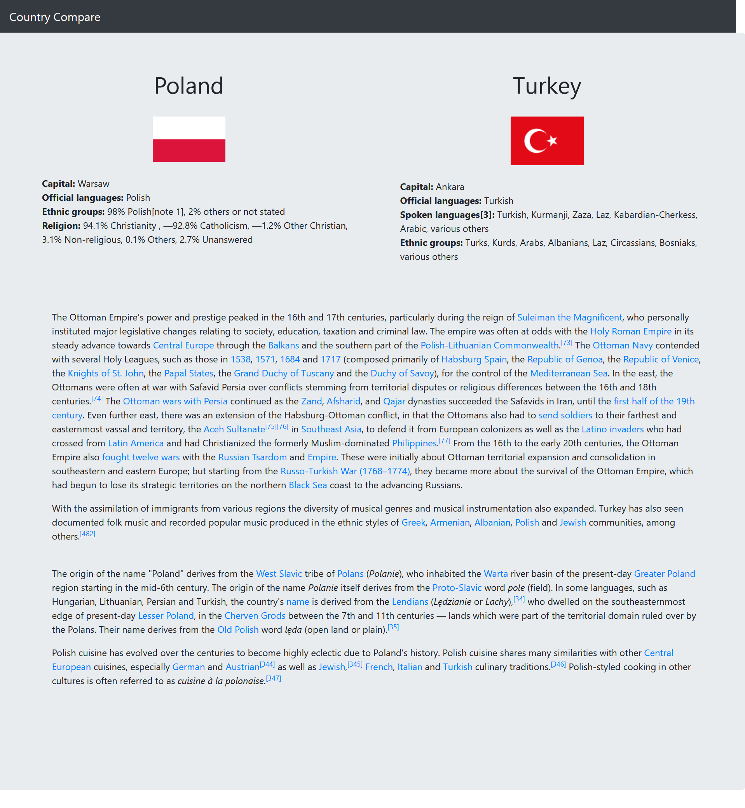

# Country Compare
This project is a website created using python (flask) that lets you choose two countries, afterwards compares these two countries. While comparing the countries it scrapes data from wikipedia.  
[View website on heroku](https://country-compare-stage.herokuapp.com)

## Preview

